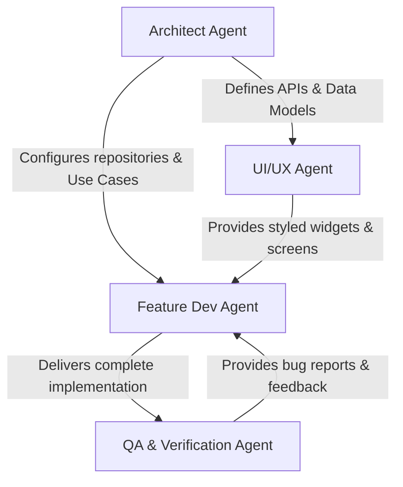

# AI Agent Governance & Handover Protocols: Pink Auto Customer App

To ensure seamless collaborative engineering between humans and AI agents in subsequent phases of the **Pink Auto Customer App**, this document establishes roles, agent personas, task boundaries, and execution handovers.

---

## 1. Agent Personas & Areas of Responsibility

### 1. Architect Agent
- **Focus**: Overall application structure, routing configurations, third-party dependency orchestration, global state patterns, caching policies, and data flow.
- **Responsibilities**:
  - Set up global service locators (e.g., GetIt).
  - Define interfaces for repositories and data sources.
  - Implement app-wide middleware, interceptors, and local DB migrations.

### 2. UI/UX Designer Agent
- **Focus**: Premium visual presentation, high-fidelity widgets, layouts, theme alignment (Pink & Purple system), asset styling, transitions, and micro-animations.
- **Responsibilities**:
  - Code visual components under `lib/core/theme/`, `lib/core/mds/`, and shared widget folders.
  - Implement visual elements, buttons, text fields, and gradient backgrounds.
  - Maintain absolute compliance with visual guides (safe margins, accessibility contrast, smooth gestures).

### 3. Feature Developer Agent
- **Focus**: Feature execution, business logic implementation, API consumption, local caching, and user event handling.
- **Responsibilities**:
  - Implement feature use cases, ViewModels, BLoCs/Cubits, and repositories.
  - Connect UI pages (from UI/UX Agent) with ViewModel states and domain business logic.
  - Handle exceptions, connection losses, and error feedback to the user.

### 4. QA & Verification Agent
- **Focus**: Quality assurance, performance audits, unit/widget/integration testing, and crash resolution.
- **Responsibilities**:
  - Run package analyzer and linter commands.
  - Write widget tests for major visual flows (auth, booking).
  - Validate performance metrics (memory leaks on maps, lag in animations).

---

## 2. Handover Protocols & Workflows

### Protocol A: Feature Launch Flow
1. **Design Alignment**: UI/UX Agent creates the screen wireframe/UI code.
2. **Logic Integration**: Feature Dev Agent integrates the page into the ViewModel or BLoC state management and connects repositories.
3. **Data Hooking**: Feature Dev Agent links repository calls to the local/remote Data Source (established by the Architect Agent).
4. **Verification**: QA Agent writes tests, executes the UI on the runner, and signs off.

### Protocol B: Bug Resolution
1. **Reporting**: Bug reports are filed, and QA Agent isolates the issue (Presentation, Domain, or Data layer).
2. **Assignment**: If it's a layout bug, assign to UI/UX Agent. If it's logical or asynchronous, assign to Feature Developer Agent.
3. **Validation**: QA Agent verifies the fix with a regression test before merging.
